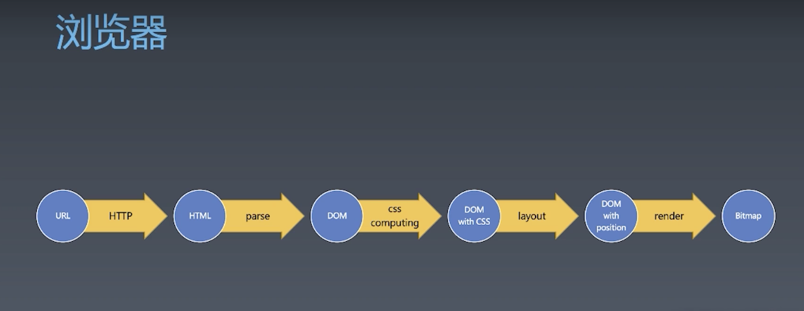

# 浏览器工作原理

浏览器加载页面的过程

### response响应返回格式 

HTTP/1.1 200 OK
Content-Type: text/html
Date: Mon, 23 Dec 2019 06:46:19 GMT
Connection: keep-alive
Transfer-Encoding: chunked

26
<html><body>Hello World<body></html>
0

###有限状态机

- 每一个状态都是一个机器
  - 在每个机器里，我们可以做计算、存储、输出
  - 所有的这些机器接受的输入是一致的
  - 状态机的每一个机器本身没有状态，如果我们用函数来表示的话，它应该是纯函数，无副作用
- 每一个机器知道下一个状态
   - 每个机器都有确定的下一个状态（Moore）
   - 每个机器根据输入决定下一个状态（Mealy）

 